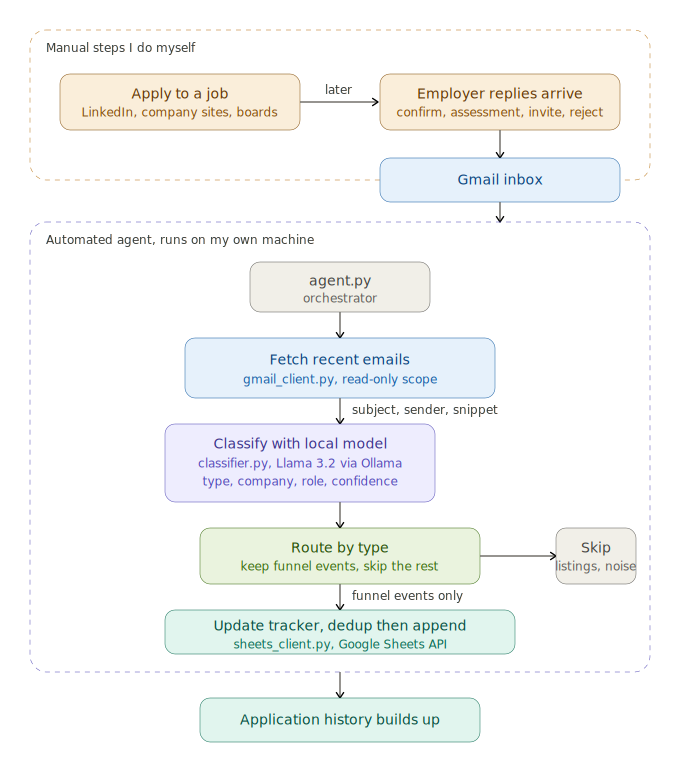

# Job Application Email Agent

An AI agent that reads my Gmail, understands which messages relate to my job search,
and automatically maintains my job-application tracker — using a language model that
runs **entirely on my own machine**, so my email content never leaves my computer.

I built this to run my own job search. Every "thanks for applying" confirmation,
interview invite, and rejection lands in my inbox in a hundred different phrasings;
this agent reads them, classifies each one, and keeps my tracker up to date without
manual data entry.

## What it does

1. **Reads** my Gmail using the Gmail API with **read-only** access.
2. **Classifies** each email with a local LLM (Llama 3.2 3B via Ollama) into one of:
   `application_confirmation`, `interview_invite`, `rejection`, `assessment`,
   `job_listing`, or `other` — and extracts the company and role when present.
3. **Writes** the relevant emails to a Google Sheets job tracker, mapping each to the
   right columns and status, with a duplicate guard so it can be run repeatedly.

## Why it's built this way

**Why an LLM instead of keyword rules.** Job-related emails are unstructured and
endlessly varied — a rejection might read "we've decided to move forward with other
candidates," "the position has been filled," or "we'll keep your resume on file."
Keyword rules break on that variety. The model reads *meaning*, including cases where
the subject line gives nothing away and only the body reveals the email's intent. The
model returns strict JSON with a confidence score, and the code validates it and flags
low-confidence cases rather than trusting them blindly.

**Why a local model.** Email is sensitive. Running the classifier locally with Ollama
means email content is never sent to a third-party API — inference happens on my own
hardware. This is both a privacy decision and a cost decision (no per-token charges).

## Architecture



- `gmail_client.py` — OAuth authentication and read-only message fetching.
- `classifier.py` — prompt + call to the local model; parses and validates the JSON.
- `sheets_client.py` — append rows to the tracker; reads existing rows for dedup.
- `agent.py` — ties them together: fetch → classify → write, with a configurable
  filter (`WRITE_LISTINGS`) and duplicate detection.

## Tech stack

- **Python**
- **Ollama** running **Llama 3.2 3B** (local inference)
- **Gmail API** (read-only scope) + **Google Sheets API**, via OAuth 2.0
- `google-api-python-client`, `google-auth-oauthlib`, `ollama`, `python-dotenv`

## Security & privacy decisions

- **Gmail access is read-only** (`gmail.readonly`) — the agent can never send, delete,
  or modify email.
- **Email content stays local** — classification runs on-device via Ollama; no email
  text is sent to any external API.
- **Secrets are kept out of the repository** — credentials, OAuth tokens, and the
  spreadsheet ID live in a git-ignored `.env` / credential files, never in code.
- **Writes are append-only** to a single tracker tab — the agent cannot overwrite or
  delete existing data.
- **Minimal, explicit scopes** — the agent requests only Gmail-read and Sheets-write,
  and scope changes force re-consent.

## Setup

1. Install dependencies: `pip install -r requirements.txt`
2. Install [Ollama](https://ollama.com) and pull the model: `ollama pull llama3.2:3b`
3. Create a Google Cloud project, enable the **Gmail API** and **Google Sheets API**,
   and download an OAuth **Desktop app** credential as `credentials.json`.
4. Create a `.env` file with:
   ```
   SHEET_ID=your_google_sheet_id
   ```
5. Run `python agent.py`. On first run, a browser opens to grant read-only Gmail and
   Sheets access; a token is then cached locally for subsequent runs.

## Roadmap / what I'd improve next

- **SMS alerts** for time-sensitive emails (interview invites, assessments).
- **Funnel analytics** on the tracker — response rate, interview rate, days-to-rejection.
- **Front-of-funnel fit scoring** — paste a job description and score it against my resume.
- **Confidence-based review queue** for low-confidence classifications.

---

*Built as a personal tool and portfolio project. The classifier runs locally to keep
email private.*
